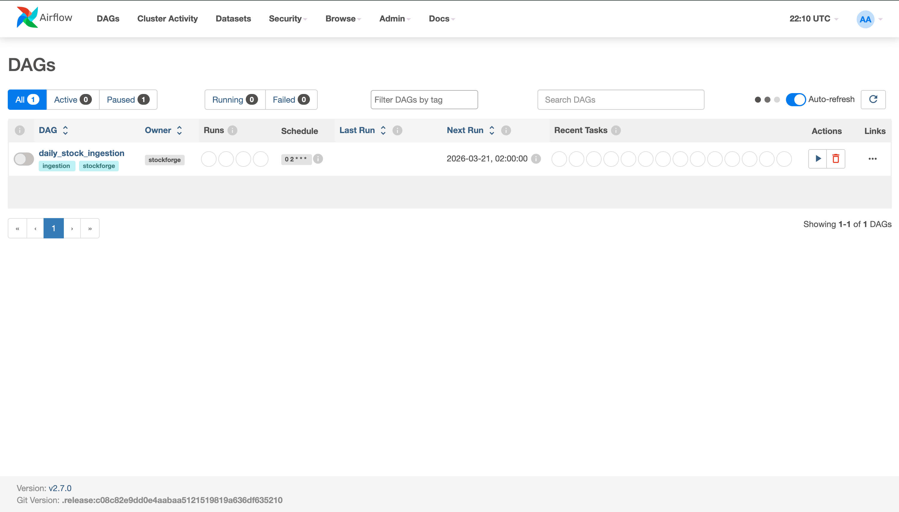
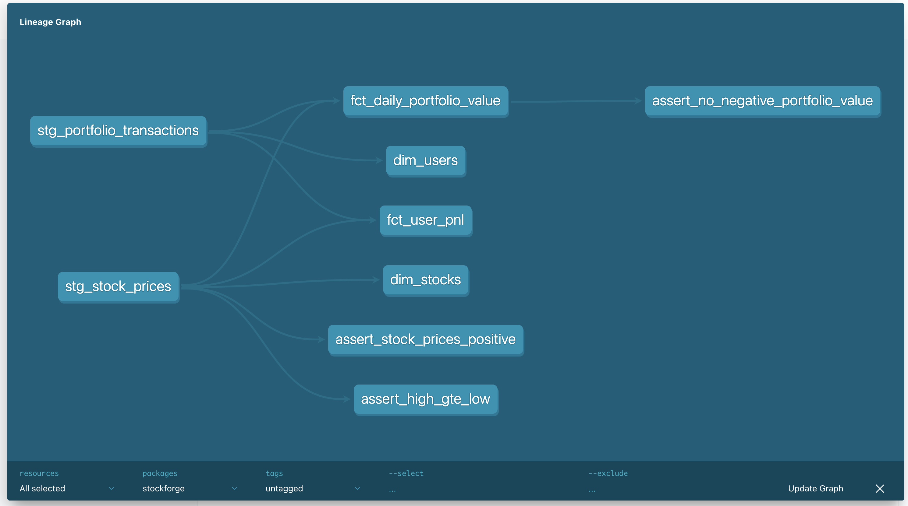
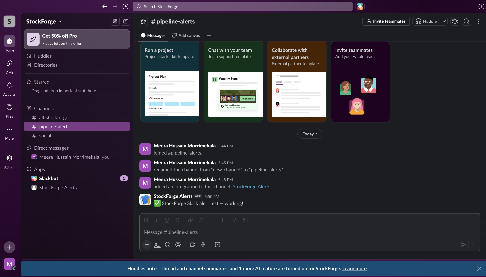
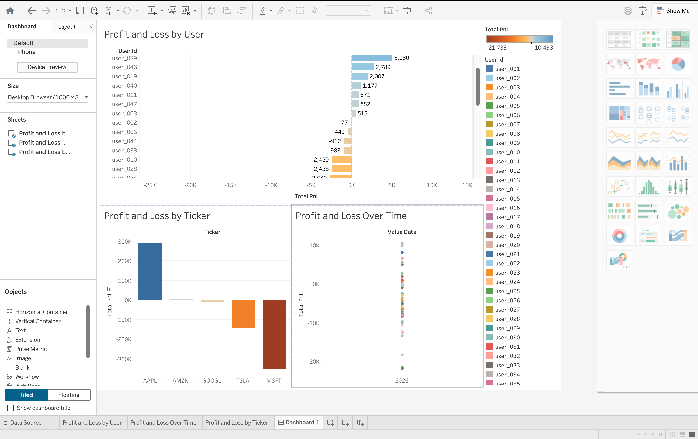

# StockForge — Real-Time Stock Analytics Pipeline

Production-grade data engineering pipeline that ingests, streams, transforms, and validates stock market data end-to-end.

**Stack**: Yahoo Finance → Kafka → Airflow → dbt → Snowflake + Great Expectations + CI/CD
**Cost**: $0 (trial) → ~$8/month (production)


---

## Architecture

```
Yahoo Finance (yfinance)
    ↓
Great Expectations — validate CSVs (35 checks)
    ↓
Kafka Producer → Topics: stock_prices, portfolio_transactions
    ↓
Kafka Consumer → Snowflake RAW (kafka_staging schema)
    ↓
Airflow DAG — daily_stock_ingestion (2 AM UTC) + Slack alerts on failure
    ↓
dbt Transformations — incremental models (6 models, 39 tests)
    ├── Staging:    stg_stock_prices, stg_portfolio_transactions
    ├── Dimensions: dim_users, dim_stocks
    └── Facts:      fct_daily_portfolio_value, fct_user_pnl
    ↓
Snowflake ANALYTICS schema
    ↓
Monitoring Dashboard (SQL — freshness, anomalies, health checks)
```

GitHub Actions runs `dbt test` on every push to master.

---

## Key Design Decisions

- Kafka KRaft mode (no Zookeeper) — modern, production-ready
- Kafka consumer commits offsets only after successful Snowflake insert — no data loss on failure
- Snowflake auto-suspend = 10 min — saves ~$1,430/month vs always-on
- dbt incremental models — only process new rows on each run
- Great Expectations validates source data before it enters Snowflake
- Two ingestion paths: direct batch load + Kafka consumer (streaming)
- CI/CD via GitHub Actions — dbt tests run on every push
- Slack webhook alerts on Airflow DAG failures

---

## Data

- **5 stocks**: AAPL, GOOGL, MSFT, AMZN, TSLA
- **2 years** of daily OHLCV prices (2505 rows)
- **3050 simulated transactions** — 50 users, BUY/SELL via 50-day moving average logic
- **39 dbt tests** — all passing
- **35 Great Expectations checks** — all passing

---

## Prerequisites

- Python 3.9+
- Docker Desktop
- Snowflake trial account

---

## Setup

### 1. Clone and install dependencies

```bash
git clone https://github.com/meerahussain733/stockforge.git
cd stockforge
python -m venv .venv
source .venv/bin/activate
pip install -r requirements.txt
```

### 2. Configure environment variables

```bash
cp .env.example .env
# Fill in your Snowflake credentials and optional Slack webhook
```

### 3. Run Snowflake setup

Run `scripts/snowflake_setup.sql` in the Snowflake UI to create databases, schemas, and tables.

### 4. Fetch and validate data

```bash
python python/fetch_stocks.py
python python/generate_transactions.py
python great_expectations/run_validation.py
python python/load_to_snowflake.py
```

### 5. Start Kafka and stream data

```bash
docker compose up -d
bash kafka/topics.sh
python kafka/producer.py
python kafka/consumer.py   # Ctrl+C when done
```

### 6. Run dbt transformations

```bash
dbt run --profiles-dir dbt/ --project-dir dbt/ --full-refresh  # first time
dbt run --profiles-dir dbt/ --project-dir dbt/                 # incremental
dbt test --profiles-dir dbt/ --project-dir dbt/
```

### 7. Start Airflow

```bash
docker compose -f airflow/docker-compose-airflow.yml up airflow-init
docker compose -f airflow/docker-compose-airflow.yml up -d
# UI: http://localhost:8080  (airflow / airflow)
```

---

## Project Structure

```
stockforge/
├── python/                  # Ingestion scripts
│   ├── fetch_stocks.py      # Fetch OHLCV data via yfinance
│   ├── generate_transactions.py  # Simulate portfolio trades
│   ├── load_to_snowflake.py # Batch load to Snowflake
│   └── test_snowflake.py    # Connection test
├── kafka/                   # Streaming layer
│   ├── producer.py          # Publish CSV data to Kafka topics
│   ├── consumer.py          # Consume from Kafka, write to Snowflake
│   └── topics.sh            # Create Kafka topics
├── airflow/                 # Orchestration
│   ├── dags/
│   │   └── daily_ingestion.py  # Main pipeline DAG + Slack alerts
│   └── docker-compose-airflow.yml
├── dbt/                     # SQL transformations
│   ├── models/
│   │   ├── staging/         # Incremental: stg_stock_prices, stg_portfolio_transactions
│   │   ├── marts/           # dim_users, dim_stocks, fct_daily_portfolio_value, fct_user_pnl
│   │   └── tests/           # Custom SQL tests
│   ├── macros/
│   ├── dbt_project.yml
│   └── profiles.yml
├── great_expectations/      # Data quality validation
│   └── run_validation.py
├── monitoring/              # Pipeline health queries
│   └── monitoring_queries.sql
├── scripts/                 # Snowflake setup SQL
│   └── snowflake_setup.sql
├── .github/workflows/       # CI/CD
│   └── dbt_ci.yml           # Auto-run dbt tests on push
├── docker-compose.yml       # Kafka (KRaft mode, no Zookeeper)
├── requirements.txt
└── .env.example
```

---

## Cost Breakdown

| Component | Monthly |
|---|---|
| Snowflake XSMALL (auto-suspend 10 min) | ~$8 |
| Everything else (Kafka, Airflow, GitHub Actions, Slack) | $0 |
| **Total** | **~$8** |

---

## Pipeline in Action

**Airflow DAG — daily_stock_ingestion**


**dbt Lineage Graph**


**Slack Failure Alert**


**Tableau Dashboard — Portfolio Analytics**

